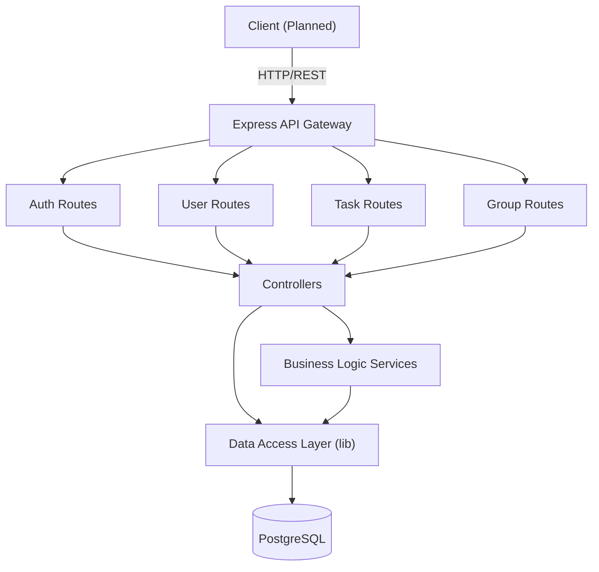

# StudyConnect – Final Prototype Presentation

**Group:** 03
**Members:** Laurent Siwaily, Tom Karaqi, Hashmatulla Habibi, Linus Sauerland, Marius Buchenloh

---

## 1. Introduction

StudyConnect is a fictitious application developed as part of the Software Testing Lab.
The goal of the project is to support students in organizing their individual learning tasks while also enabling collaboration within study groups.

StudyConnect focuses on streamlining daily study workflows by avoiding bloated functionality. It provides a clear and structured way to create tasks with titles, deadlines, priorities, and notes, track their progress, and keep all group members aligned. Tasks can represent homework assignments, exam preparation steps, or project milestones.

The objective of our prototype is to implement the core functionality of StudyConnect using a modern software architecture, while applying software quality and testing practices learned during the course.

---

## 2. Implementation Overview

### 2.1 Prototype Status
The backend is largely implemented with a functional REST API, database schema, and testing harness. The frontend is currently planned but not yet implemented.

### 2.2 Tech Stack
- **Frontend:** Not yet implemented (Planned: React + TypeScript + Vite)
- **Backend:** Node.js, Express, TypeScript
- **Database:** PostgreSQL (v15-alpine via Docker)
- **Tools & Frameworks:** Docker, Docker Compose, Git, GitHub Actions

### 2.3 Key Implementation Details
- **API Style:** RESTful API exposing resources like Auth, Users, Groups, and Tasks.
- **State Management:** Stateless Backend API using JWT for authentication.
- **Data Model:** Relational model (PostgreSQL) managed via raw SQL (`schema.sql`) and migrations. Key entities include Users, Groups, Tasks, Comments, and Notifications.
- **Authentication:** JSON Web Tokens (JWT) for session handling and Bcrypt for password hashing.

### 2.4 Architecture
The system follows a layered architecture: `Routes` -> `Controllers` -> `Services` -> `Data Access Layer (DAL)`.

### 2.5 Integrated Tools / Services
- **CI/CD:** GitHub Actions (configured in `tests.yml`, `npm-audit.yml`).
- **Testing:**
    - **Unit/Integration:** Jest
    - **BDD:** Cucumber
    - **Load Testing:** JMeter (`.jmx` files)
    - **API Testing:** Postman Collection
- **Code Quality:** SonarQube (`sonar-project.properties`) and ESLint.

### 2.6 Demo (Optional)

## 3. Requirements Recap

### 3.1 Initial Requirements

**Functional requirements:**
- user management (register/login, profiles, join/leave groups, admin invites/
    removals, role-based permissions)
- task/goal management (CRUD with title/notes/priority/due date/category, states
    open/in progress/completed, list/filter/sort, export to PDF/ICS)
- group collaboration (create groups, assign tasks, task comments/messages, 
    members update progress, group-wide overview) 
- deadline awareness (show upcoming/overdue, highlight urgency, reminders/
    notifications, visualize progress)
- motivation/gamification (points/badges, achievement view, non-intrusive)
- accessibility/integration (web app across devices, data sync, exports, 
    modular extensions).

**Quality requirements:**
- usability (intuitive, quick task creation)
- functional suitability (complete/correct functions)
- reliability (stable, no data loss, recoverable sessions)
- portability (works across environments, exports/integrations)
- testability (modular, role separation, finite task states).

### 3.2 Implementation Status

Implemented successfully: 

backend covers user auth/profile, group creation/membership with roles, task CRUD with statuses, assignments, comments, overdue marking, ICS export, notifications endpoints, and gamification (points/badges, leaderboard). 
Quality-wise, functional suitability/testability are supported by modular design and Jest tests 

Not (fully) covered yet:

- No PDF export implementation (only ICS).
- Notifications are manual endpoints; no scheduled reminders/real push setup.
- Reliability targets (availability/recovery) and data sync across devices aren’t 
    addressed; backend uses in-memory/DB stubs without deployment/ops safeguards.
- other quality goals (usability, portability across devices, operational reliability) remain largely unproven.

### 3.3 Changes & Decisions
- **Postponed Frontend Development:**
  - **Decision:** Shifted focus entirely to Backend API completeness and extensive testing (Unit, BDD, Load).
  - **Reason:** Ensuring a robust, testable core architecture was prioritized over UI implementation within the limited time frame.

- **Simplified Notifications:**
  - **Decision:** Implemented as API endpoints (polling model) instead of real-time push (WebSockets).
  - **Reason:** Reduced complexity to ensure stable delivery of the core logic and notification storage.

- **Dropped PDF Export:**
  - **Decision:** Only ICS (Calendar) export was implemented; PDF export was dropped.
  - **Reason:** ICS offers higher utility for students to integrate tasks into their existing digital calendars compared to static PDF files.

### 3.4 UI / UX Considerations
- **Design Principles (KISS):** 
    - The *planned* UI prioritizes strict minimalism to reduce cognitive load.
    - "Less is More": Only essential actions (Create, Complete) will be prominent.
- **Accessibility:** 
    - Planned compliance with WCAG 2.1 AA.
    - Focus on semantic HTML and keyboard navigability.
- **User Flow:** 
    - **Streamlined Actions:** Minimizing clicks for frequent tasks to allow quick entry/updates.
    - **Intuitive Navigation:** Flat hierarchy to avoid deep nesting of menus.
- **Responsiveness (Planned):** 
    - **Flexible Layout:** The design concept ensures usability on both small (mobile) and large (desktop) screens, ensuring students can access the tool anywhere.

---

## 4. Retrospective & Lessons Learned

### 4.1 Team Organization
- The tasks were in general distributed by our Whatsapp or Discord chat group. When someone started a task, he informed the rest of the team so there won't be any collisions. When he finished the task, he pushed it to the git-repo and sent a message to the group, so that everyone else was notified.
- There were no fixed roles at all, every member did everything once.
- There was also no official team leader. Main decisions were made by all members by discussion.

### 4.2 Challenges
- **Technical Challenges:**
    - **Dockerized Testing:** Configuring Jest and Cucumber to communicate reliably with the containerized PostgreSQL database (handling connection timing and networking).
    - **Type Safety w/ Raw SQL:** Manually maintaining TypeScript interfaces to match `schema.sql` entities without the safety net of an ORM.
    - **Test Data Isolation:** Ensuring strict cleanup between BDD scenarios so that data from one test didn't cause failures in another.
    - **Scheduling & Coordination:** With 5 members balancing different jobs, university timetables, and personal lives, finding common synchronous meeting times was extremely difficult, slowing down decision-making.

### 4.3 What Worked Well
- Tools: Using Github was at first unfamiliar, especially for the non-programmers among us, but we had a good learning experience and very informative team members and in the end we managed to use Github as intended.
- Collaboration: There were no group internal problems at all. Everyone did his part and we did not argue at all.
- Processes

### 4.4 What Didn’t Work Well
- Time management: As we only had one week for each assignment and there are other tasks from other subjects to do also, we sometimes had to struggle to get the assignment done in time.
- Mistakes: As the application grew bigger it was a bit tricky to keep track of all the requirements, for example docker needs to be up before running the app and so on.

### 4.5 Exercises & Learning Outcomes
- Most helpful or interesting exercise: Integrating the testing in the CI pipeline was very interesting.
- Key takeaways: Features of Github one doesn't usually use: secrets management, actions.

### 4.6 Improvements & Suggestions
- Suggestions to improve the lecture / course: Mixed groups (ISB/SWB) are better, especially for the ISB-members as all the details of programming are new to them. As an ISB student one does not necessarily know very much about Github.

---

## 5. Optional: Additional Aspects

### 5.1 Testing
- Unit tests
- Integration tests
- API tests
- Test coverage (if available)

### 5.2 CI / Quality Metrics
- CI reports
- Static analysis
- Performance or load testing

### 5.3 Deployment
- Deployment platform (e.g. bwCloud, Vercel, Heroku)
- Public access: Yes / No
- URL: <Link>

### 5.4 Documentation & Collaboration
- Documentation style: We created markdown files in Github, one file for each assignment. In the md file we recreated the structure of the assignment and put our documentation in between.
- Collaboration workflow (Git, issues, pull requests)

---

## 6. Conclusion

Short summary of the prototype, lessons learned, and final thoughts.

---

## 7. Links
- Repository: https://github.com/To-Kar/studyconnect
